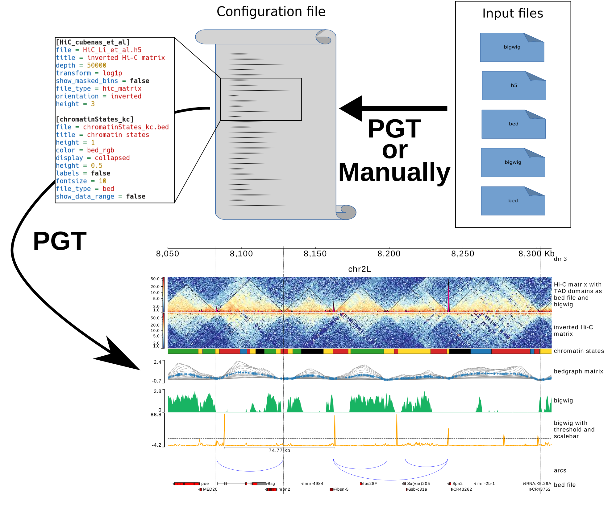

[](https://pypi.org/project/pyGenomeTracks/) [](https://anaconda.org/bioconda/pygenometracks)
[](http://bioconda.github.io)
[](https://dev.azure.com/wolffj/pyGenomeTracks/_build/latest?definitionId=2&branchName=master)

[![European Galaxy server](https://img.shields.io/badge/usegalaxy-.eu-brightgreen?logo=data:image/png;base64,iVBORw0KGgoAAAANSUhEUgAAABgAAAASCAYAAABB7B6eAAAABGdBTUEAALGPC/xhBQAAACBjSFJNAAB6JgAAgIQAAPoAAACA6AAAdTAAAOpgAAA6mAAAF3CculE8AAAACXBIWXMAAAsTAAALEwEAmpwYAAACC2lUWHRYTUw6Y29tLmFkb2JlLnhtcAAAAAAAPHg6eG1wbWV0YSB4bWxuczp4PSJhZG9iZTpuczptZXRhLyIgeDp4bXB0az0iWE1QIENvcmUgNS40LjAiPgogICA8cmRmOlJERiB4bWxuczpyZGY9Imh0dHA6Ly93d3cudzMub3JnLzE5OTkvMDIvMjItcmRmLXN5bnRheC1ucyMiPgogICAgICA8cmRmOkRlc2NyaXB0aW9uIHJkZjphYm91dD0iIgogICAgICAgICAgICB4bWxuczp0aWZmPSJodHRwOi8vbnMuYWRvYmUuY29tL3RpZmYvMS4wLyI+CiAgICAgICAgIDx0aWZmOlJlc29sdXRpb25Vbml0PjI8L3RpZmY6UmVzb2x1dGlvblVuaXQ+CiAgICAgICAgIDx0aWZmOkNvbXByZXNzaW9uPjE8L3RpZmY6Q29tcHJlc3Npb24+CiAgICAgICAgIDx0aWZmOk9yaWVudGF0aW9uPjE8L3RpZmY6T3JpZW50YXRpb24+CiAgICAgICAgIDx0aWZmOlBob3RvbWV0cmljSW50ZXJwcmV0YXRpb24+MjwvdGlmZjpQaG90b21ldHJpY0ludGVycHJldGF0aW9uPgogICAgICA8L3JkZjpEZXNjcmlwdGlvbj4KICAgPC9yZGY6UkRGPgo8L3g6eG1wbWV0YT4KD0UqkwAAAn9JREFUOBGlVEuLE0EQruqZiftwDz4QYT1IYM8eFkHFw/4HYX+GB3/B4l/YP+CP8OBNTwpCwFMQXAQPKtnsg5nJZpKdni6/6kzHvAYDFtRUT71f3UwAEbkLch9ogQxcBwRKMfAnM1/CBwgrbxkgPAYqlBOy1jfovlaPsEiWPROZmqmZKKzOYCJb/AbdYLso9/9B6GppBRqCrjSYYaquZq20EUKAzVpjo1FzWRDVrNay6C/HDxT92wXrAVCH3ASqq5VqEtv1WZ13Mdwf8LFyyKECNbgHHAObWhScf4Wnj9CbQpPzWYU3UFoX3qkhlG8AY2BTQt5/EA7qaEPQsgGLWied0A8VKrHAsCC1eJ6EFoUd1v6GoPOaRAtDPViUr/wPzkIFV9AaAZGtYB568VyJfijV+ZBzlVZJ3W7XHB2RESGe4opXIGzRTdjcAupOK09RA6kzr1NTrTj7V1ugM4VgPGWEw+e39CxO6JUw5XhhKihmaDacU2GiR0Ohcc4cZ+Kq3AjlEnEeRSazLs6/9b/kh4eTC+hngE3QQD7Yyclxsrf3cpxsPXn+cFdenF9aqlBXMXaDiEyfyfawBz2RqC/O9WF1ysacOpytlUSoqNrtfbS642+4D4CS9V3xb4u8P/ACI4O810efRu6KsC0QnjHJGaq4IOGUjWTo/YDZDB3xSIxcGyNlWcTucb4T3in/3IaueNrZyX0lGOrWndstOr+w21UlVFokILjJLFhPukbVY8OmwNQ3nZgNJNmKDccusSb4UIe+gtkI+9/bSLJDjqn763f5CQ5TLApmICkqwR0QnUPKZFIUnoozWcQuRbC0Km02knj0tPYx63furGs3x/iPnz83zJDVNtdP3QAAAABJRU5ErkJggg==)](https://usegalaxy.eu/root?tool_id=pygenomeTracks)

pyGenomeTracks
==============

Standalone program and library to plot beautiful genome browser tracks
----------------------------------------------------------------------

pyGenomeTracks aims to produce high-quality genome browser tracks that
are highly customizable. Currently, it is possible to plot:

 * bigwig
 * bed/gtf (many options)
 * bedgraph
 * bedgraph matrices (like TAD-separation scores)
 * epilogos
 * narrow peaks
 * links (represented as arcs, triangles or squares)
 * Hi-C matrices (as triangle or squares)
 * fasta
 * maf (multiple alignment format)

Here is a scheme which describe how pyGenomeTracks is working (graphical abstract of [Lopez-Delisle et al. 2020](https://doi.org/10.1093/bioinformatics/btaa692)):



pyGenomeTracks can make plots with or without Hi-C data. The following is an example output of
pyGenomeTracks from [Ramírez et al. 2017](https://www.nature.com/articles/s41467-017-02525-w)


Table of content
----------------

* [Installation](#installation)
* [Usage](#usage)
* [Citation](#citation)
* [Documentation](#documentation)
* [External users](#external-users)

Installation
------------

pyGenomeTracks works with python >=3.7.

The recommended way to install pyGenomeTracks is via conda

```bash
conda create -n pygenometracks -c bioconda -c conda-forge pygenometracks python=3.7
```

To get a specific version, one can specify it. For example:

```bash
conda create -n pygenometracks -c bioconda -c conda-forge pygenometracks=3.5 python=3.7
```

However, we noticed that conda installation can be quite slow so using mamba can help.
You first need to create the environment and install mamba:

```bash
conda create -n pygenometracks -c bioconda -c conda-forge mamba python=3.7
```

Then activate the environment and install pygenometracks with mamba:

```bash
conda activate pygenometracks
mamba install -c conda-forge -c bioconda pygenometracks
```

or if you want a specific version:

```bash
conda create -n pygenometracks -c bioconda -c conda-forge mamba python=3.7
conda activate pygenometracks
mamba install -c conda-forge -c bioconda pygenometracks=3.5
```

Also, pyGenomeTracks can be installed using pip

```bash
pip install pyGenomeTracks
```

Since version 3.5, pyGenomeTracks uses BEDTools, don't forget to install it or load it into your environment.

Usage
-----

To run pyGenomeTracks a configuration file describing the tracks is required. The easiest way to create this file is using the program `make_tracks_file` which creates a configuration file with
defaults that can be easily changed. The format is:

```bash
make_tracks_file --trackFiles <file1.bed> <file2.bw> ... -o tracks.ini
```

`make_tracks_file` uses the file ending to guess the file type.

Then, a region can be plotted using:

```bash
pyGenomeTracks --tracks tracks.ini --region chr2:10,000,000-11,000,000 --outFileName nice_image.pdf
```

The ending `--outFileName` defines the image format. If `.pdf` is used, then the resulting image is a pdf. The options are pdf, png and svg.

Description of other possible arguments:
<!--- Start of possible arguments of pgt -->
``` text
optional arguments:
  -h, --help            show this help message and exit
  --tracks TRACKS       File containing the instructions to plot the tracks.
                        The tracks.ini file can be genarated using the
                        `make_tracks_file` program.
  --region REGION       Region to plot, the format is chr:start-end
  --BED BED             Instead of a region, a file containing the regions to
                        plot, in BED format, can be given. If this is the
                        case, multiple files will be created. It will use the
                        value of --outFileName as a template and put the
                        coordinates between the file name and the extension.
  --width WIDTH         figure width in centimeters (default is 40)
  --plotWidth PLOTWIDTH
                        width in centimeters of the plotting (central) part
  --height HEIGHT       Figure height in centimeters. If not given, the figure
                        height is computed based on the heights of the tracks.
                        If given, the track height are proportionally scaled
                        to match the desired figure height.
  --title TITLE, -t TITLE
                        Plot title
  --outFileName OUTFILENAME, -out OUTFILENAME
                        File name to save the image, file prefix in case
                        multiple images are stored
  --fontSize FONTSIZE   Font size for the labels of the plot (default is 0.3 *
                        figure width)
  --dpi DPI             Resolution for the image in case the ouput is a raster
                        graphics image (e.g png, jpg) (default is 72)
  --trackLabelFraction TRACKLABELFRACTION
                        By default the space dedicated to the track labels is
                        0.05 of the plot width. This fraction can be changed
                        with this parameter if needed.
  --trackLabelHAlign {left,right,center}
                        By default, the horizontal alignment of the track
                        labels is left. This alignemnt can be changed to right
                        or center.
  --decreasingXAxis     By default, the x-axis is increasing. Use this option
                        if you want to see all tracks with a decreasing
                        x-axis.
  --version             show program's version number and exit
```
<!--- End of possible arguments of pgt -->

Citation
--------

If you use pyGenomeTracks in your analysis, you can cite the following papers:

Fidel Ramírez, Vivek Bhardwaj, Laura Arrigoni, Kin Chung Lam, Björn A. Grüning, José Villaveces, Bianca Habermann, Asifa Akhtar & Thomas Manke. High-resolution TADs reveal DNA sequences underlying genome organization in flies. Nature Communications (2018) [doi:10.1038/s41467-017-02525-w](https://www.nature.com/articles/s41467-017-02525-w)

Lopez-Delisle L, Rabbani L, Wolff J, Bhardwaj V, Backofen R, Grüning B, Ramírez F, Manke T. pyGenomeTracks: reproducible plots for multivariate genomic data sets. Bioinformatics. 2020 Aug 3:btaa692. [doi: 10.1093/bioinformatics/btaa692](https://doi.org/10.1093/bioinformatics/btaa692). Epub ahead of print. PMID: 32745185.

Documentation
-------------

Our [documentation](http://pygenometracks.readthedocs.io/) provide [examples](http://pygenometracks.readthedocs.org/en/latest/content/examples.html), as well as the [full list of possible parameters](http://pygenometracks.readthedocs.org/en/latest/content/possible-parameters.html) and [guidelines for developers who would like to add a new track type](http://pygenometracks.readthedocs.org/en/latest/content/adding-new-tracks.html).

<!-- I do not know what to do with that, is it External users?
pyGenomeTracks is used by [HiCExporer](https://hicexplorer.readthedocs.io/) and [HiCBrowser](https://github.com/maxplanck-ie/HiCBrowser) (See e.g. [Chorogenome navigator](http://chorogenome.ie-freiburg.mpg.de/) which is made with HiCBrowser)
 -->
External users
--------------

* [CoolBox](https://github.com/GangCaoLab/CoolBox) is an interactive genomic data explorer for Jupyter Notebooks
* [Galaxy](https://usegalaxy.eu/root?tool_id=toolshed.g2.bx.psu.edu/repos/iuc/pygenometracks/pygenomeTracks) integration offers a graphical user-interface to create PGT plots. It is also possible to include PGT into workflows and automatic pipelines.
