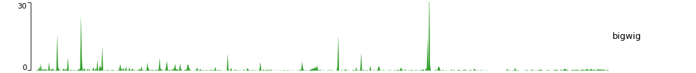

[](https://pypi.org/project/pyGenomeTracks/) [](https://anaconda.org/bioconda/pygenometracks)

pyGenomeTracks
==============

Standalone program and library to plot beautiful genome browser tracks
----------------------------------------------------------------------

pyGenomeTracks aims to produce high-quality genome browser tracks that
are highly customizable. Currently, it is possible to plot:

 * bigwig 
 * bed (many options)
 * bedgraph
 * links (represented as arcs) 
 * Hi-C matrices (if [HiCExplorer](http://hicexplorer.readthedocs.io) is installed)

pyGenomeTracks can make plots with or without Hi-C data. The following is an example output of pyGenomeTracks from [Ramírez et al. 2017](https://www.nature.com/articles/s41467-017-02525-w)


Installation
------------
pyGenomeTracks works with python 2.7 and python 3.6.

Currently, the best way to install pyGenomeTracks is with anaconda

```bash
$ conda install -c bioconda pygenometracks 
```

Also, pyGenomeTracks can be installed using pip

```bash
$ pip install pyGenomeTracks
```

If the latest version wants to be installed use:

```bash
$ pip install  git+https://github.com/maxplanck-ie/pyGenomeTracks.git
```


Usage
-----
To run pyGenomeTracks a configuration file describing the tracks is required. The easiest way to create this file is using the program `make_tracks_file` which creates a configuration file with 
defaults that can be easily changed. The format is:

```bash
$ make_tracks_file --trackFiles <file1.bed> <file2.bw> ... -o tracks.ini
```

`make_tracks_file` uses the file ending to guess the file type. 

Then, a region can be plotted using:

```bash
$ pyGenomeTracks --tracks tracks.ini --region chr2:10,000,000-11,000,000 --outFileName nice_image.pdf
```

The ending `--outFileName` defines the image format. If `.pdf` is used, then the resulting image is a pdf. The options are pdf, png and svg. 

Examples
--------

(These examples are found in the `examples/` folder)

A minimal example of a configuration file with a single bigwig track looks like this:

```INI
[bigwig file test]
file = bigwig.bw
# height of the track in cm (optional value)
height = 4
title = bigwig
min_value = 0
max_value = 30
```


```bash
$ pyGenomeTracks --tracks bigwig_track.ini --region X:2,500,000-3,000,000 -o bigwig.png
```




Now, let's add the genomic location and some genes:
```INI
[bigwig file test]
file = bigwig.bw
# height of the track in cm (optional value)
height = 4
title = bigwig
min_value = 0
max_value = 30

[spacer]
# this simply adds an small space between the two tracks.

[genes]
file = genes.bed.gz
height = 7
title = genes
fontsize = 10
file_type = bed
gene rows = 10

[x-axis]
fontsize=10
```

```bash
$ pyGenomeTracks --tracks bigwig_with_genes.ini --region X:2,800,000-3,100,000 -o bigwig_with_genes.png
```


Now, we will add some vertical lines across all tracks. The vertical lines should be in a bed format.

```INI
[bigwig file test]
file = bigwig.bw
# height of the track in cm (optional value)
height = 4
title = bigwig
min_value = 0
max_value = 30

[spacer]
# this simply adds an small space between the two tracks.

[genes]
file = genes.bed.gz
height = 7
title = genes
fontsize = 10
file_type = bed
gene rows = 10

[x-axis]
fontsize=10

[vlines]
file = domains.bed
type = vlines
```


```bash
$ pyGenomeTracks --tracks bigwig_with_genes_and_vlines.ini --region X:2,800,000-3,100,000 -o bigwig_with_genes_and_vlines.png
```


Examples with peaks
-------------------

pyGenomeTracks has an option to plot peaks using MACS2 narrowPeak format.

This is an example of the output:


Examples with Hi-C data

The following is an example with Hi-C data overlay with topologically associating domains (TADs) and a bigwig file.

```INI
[x-axis]
where = top

[hic matrix]
file = hic_data.h5
title = Hi-C data
# depth is the maximum distance plotted in bp. In Hi-C tracks
# the height of the track is calculated based on the depth such
# that the matrix does not look deformated
depth = 300000
transform = log1p
file_type = hic_matrix

[tads]
file = domains.bed
display = triangles
border color = black
color = none
# the tads are overlay over the hic-matrix
# the share-y options sets the y-axis to be shared
# between the Hi-C matrix and the TADs. 
overlay previous = share-y

[spacer]

[bigwig file test]
file = bigwig.bw
# height of the track in cm (optional value)
height = 4
title = ChIP-seq
min_value = 0
max_value = 30

```

```bash
$ pyGenomeTracks  --tracks hic_track.ini -o hic_track.png --region chrX:2500000-3500000
```


Examples with multiple options
------------------------------

A comprehensive example of pyGenomeTracks can be found as part of our automatic testing.
Note, that pyGenome tracks also allows the combination of multiple tracks into one using the parameter: `overlay previous=yes` or `overlay previous=share-y`.
In the second option the y-axis of the tracks that overlays is the same as the track being overlay. Multiple tracks can be overlay together.


The configuration file for this image is [here](./pygenometracks/tests/test_data/browser_tracks.ini)


Examples with Hi-C data
-----------------------

In these examples is where the overlay tracks are more useful. Notice that any track can be overlay over a Hi-C matrix. Most useful is to overlay TADs or to overlay links using the `triangles` option 
that will point in the Hi-C matrix the pixel with the link contact. When overlaying links and TADs is useful to set `overlay previous=share-y` such that the two tracks match the positions. This is not
required when overlying other type of data like a bigwig file that has a different y-scale.


The configuration file for this image is [here](./pygenometracks/tests/test_data/browser_tracks_hic.ini)


Adding new tracks
-----------------
Adding new tracks to pyGenomeTracks only requires adding a new class that has a `plot` method and defines some basic info.

For example, to make a track that plots some text at a given location we need to make class that looks like this:

```python
class TextTrack(GenomeTrack):
    SUPPORTED_ENDINGS = ['.txt']  # this is used to guess the type of track based on file name
    TRACK_TYPE = 'text'
    OPTIONS_TXT = """
height = 3
title = 
text = 
# x position of text in the plot (in bp) 
x position = 
"""
    def plot(self, ax, label_ax, chrom, region_start, region_end):
        # print text at position x = self.properties['x position'] and y = 0.5 (center of the plot)
        ax.text(float(self.properties['x position']), 0.5, self.properties['text'])
        # print title in legend axis
        label_ax.text(0.15, 0.5, self.properties['title'])
        
```


Now we make a configuration file.

```INI
[x-axis]
where = top

[new track]
file = 
height = 4
title = new pyGenomeTrack
file_type = text
text = hello world
x position = 3100000
```


pyGenomeTracks is used by [HiCExporer](https://hicexplorer.readthedocs.io/) and [HiCBrowser](https://github.com/maxplanck-ie/HiCBrowser) (See e.g. [Chorogenome navigator](http://chorogenome.ie-freiburg.mpg.de/) which is made with HiCBrowser)
