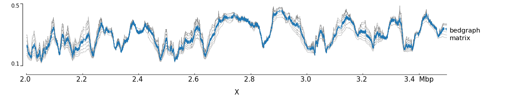

Adding new tracks
=================

Adding new tracks to pyGenomeTracks only requires adding a new class to the ``pygenometracks/tracks`` folder.
The class should inherit the ``GenomeTrack`` (or other track class available) and should have a ``plot`` method.
In order to work well with the config checker it should also have some global variable:
- ``DEFAULTS_PROPERTIES`` is a dictionary where each key is a parameter and each value is the default value when it is not set or when something goes wrong.
- ``NECESSARY_PROPERTIES``  is an array with all the parameters which are necessary for this track (usually 'file')
- ``SYNONYMOUS_PROPERTIES`` is a dictionary where each key is a parameter, each value is a dictionnary where each key is a string that should be replaced by the value (for example, ``SYNONYMOUS_PROPERTIES = {'max_value': {'auto': None}}``)
- ``POSSIBLE_PROPERTIES`` is a dictionary where each key is a parameter, each value is an array with the only possible values for this parameter, if the value specified by the user is not part of them, it will be substituted by the default value.
- ``BOOLEAN_PROPERTIES`` is an array with all parameters that should have a boolean value (a boolean value can be 0, 1, true, false, on, off)
- ``STRING_PROPERTIES`` is an array with all parameters that have string values. It should always contains ``title`` and ``file_type``.
- ``FLOAT_PROPERTIES`` is a dictionnary where each key is a parameter, each value is an array with the min value (included) and the max value (included) that should have the parameter (You can use ``[- np.inf, np.inf]`` if there is no restriction). This dictionary should always contains ``'height': [0, np.inf]``
- ``INTEGER_PROPERTIES`` same as ``FLOAT_PROPERTIES`` for integer values.

Additionally, some basic description should be added.

For example, to make a track that prints 'hello world' at a given location looks like this:

.. literalinclude:: ../../examples/helloWorldTrack.py
    :language: python

The ``OPTIONS_TXT`` should contain the text to build a default configuration file.
This information, together with the information about SUPPORTED_ENDINGS is used
by the program ``make_tracks_file`` to create a default configuration file
based on the endings of the files given.

The configuration file is:

.. literalinclude:: ../../examples/new_track.ini
    :language: INI

.. code:: bash

    $ pyGenomeTracks  --tracks new_track.ini --region X:3000000-3200000 -o new_track.png

.. image:: ../../examples/new_track.png

Notice that the resulting track already includes a y-axis (to the left) and
a label to the right. Those are the defaults that can be changed by
adding a ``plot_y_axis`` and ``plot_label`` methods.

Another more complex example is the plotting of multiple bedgraph data as matrices. The output of ``HiCExplorer hicFindTADs`` produces a file whose data format
is similar to a bedgraph but with more value columns. We call this a bedgraph matrix. The following track plot this bedgraph matrix:

.. literalinclude:: ../../examples/BedMatrixExampleTrack.py
    :language: python

Let's create a track for this:

.. literalinclude:: ../../examples/bedgraph_matrix.ini
    :language: INI

.. code:: bash

    $ pyGenomeTracks  --tracks bedgraph_matrix.ini --region X:2000000-3500000 -o bedgraph_matrix.png

.. image:: ../../examples/bedgraph_matrix.png

Although this image looks interesting another way to plot
the data is a overlapping lines with the mean value highlighted.
Using the bedgraph version of ``pyGenomeTracks`` the following image
can be obtained:

