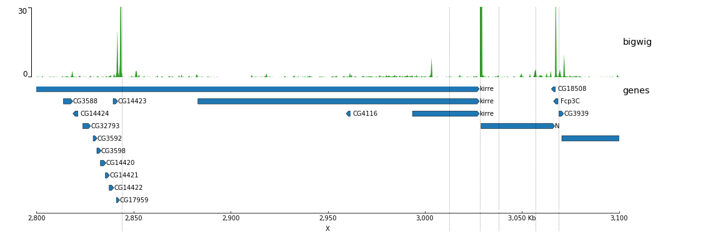
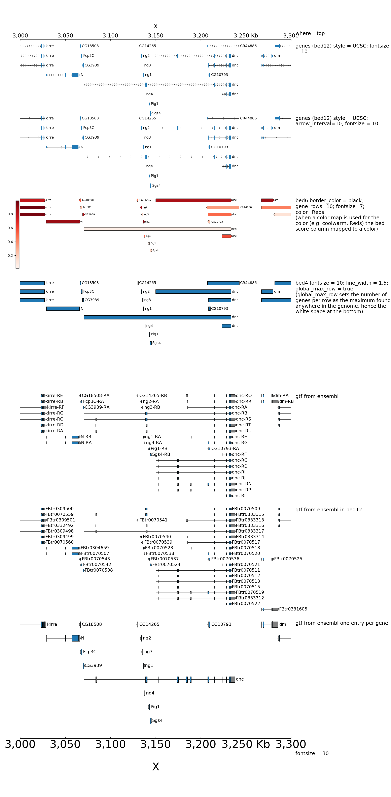
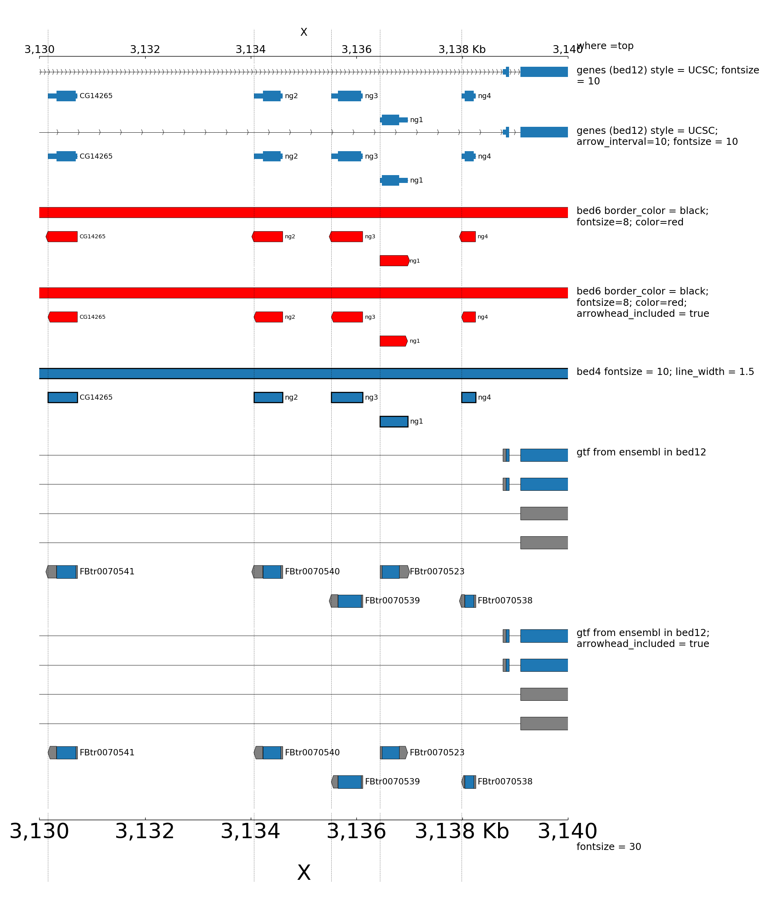
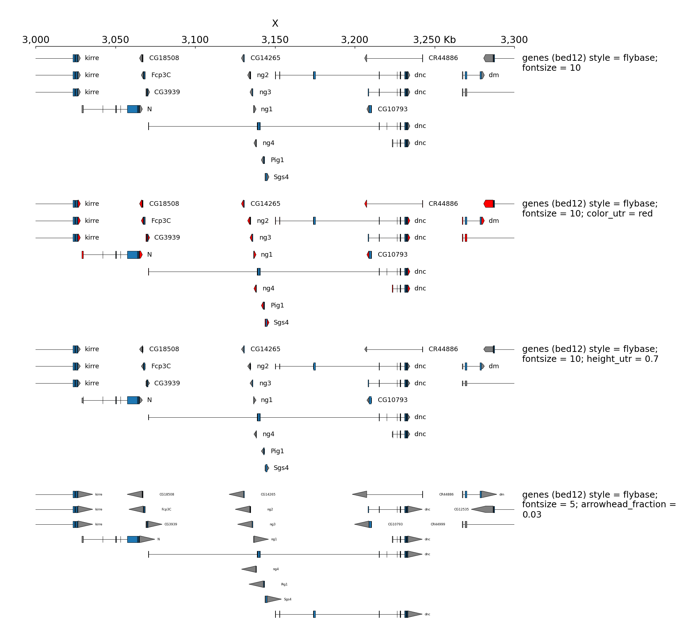
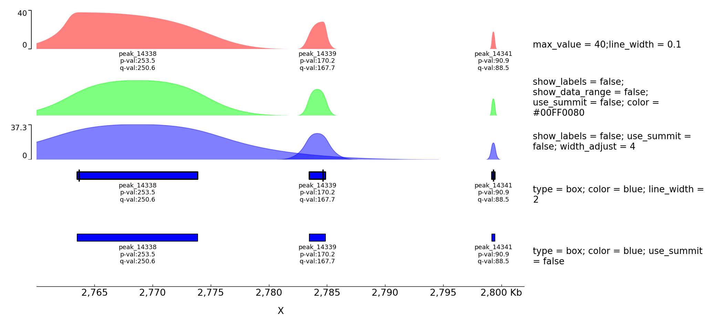
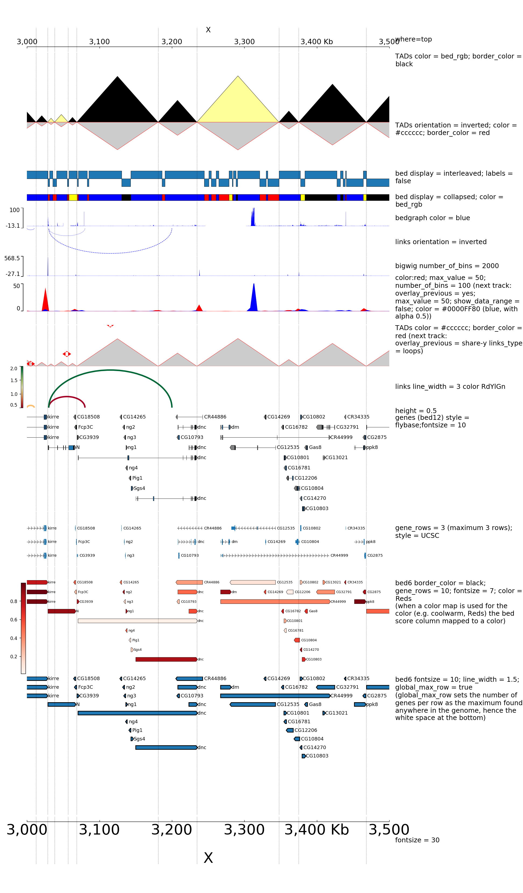

Examples
========

These examples and the input data for these examples can found in the `examples/ <https://github.com/deeptools/pyGenomeTracks/tree/master/examples>`_ or `test_data/ <https://github.com/deeptools/pyGenomeTracks/tree/master/pygenometracks/tests/test_data>`_ folders of the github repository.

.. contents:: 
    :local:

Basic Examples
--------------

A minimal example of a configuration file with a single bigwig track looks like this:

.. literalinclude:: ../../examples/bigwig_track.ini
    :language: INI

.. code:: bash

    $ pyGenomeTracks --tracks bigwig_track.ini --region X:2,500,000-3,000,000 -o bigwig.png

.. image:: ../../examples/bigwig.png

Now, let's add the genomic location and some genes:

.. literalinclude:: ../../examples/bigwig_with_genes.ini
    :language: INI

.. code:: bash

    $ pyGenomeTracks --tracks bigwig_with_genes.ini --region X:2,800,000-3,100,000 -o bigwig_with_genes.png

Now, we will add some vertical lines across all tracks. The vertical lines should be in a bed format.

.. literalinclude:: ../../examples/bigwig_with_genes_and_vlines.ini
    :language: INI

.. code:: bash

    $ pyGenomeTracks --tracks bigwig_with_genes_and_vlines.ini --region X:2,800,000-3,100,000 -o bigwig_with_genes_and_vlines.png

You can also overlay bigwig with or without transparency.

.. literalinclude:: ../../pygenometracks/tests/test_data/alpha.ini
    :language: INI

.. code:: bash

    $ pyGenomeTracks --tracks alpha.ini --region X:2700000-3100000 --trackLabelFraction 0.2 --dpi 130 -o master_alpha.png

Examples with bed and gtf
-------------------------
Here is an example to explain the parameters for bed and gtf:

.. literalinclude:: ../../pygenometracks/tests/test_data/bed_and_gtf_tracks.ini
    :language: INI
    
.. code:: bash

    $ pyGenomeTracks --tracks bed_and_gtf_tracks.ini --region X:3000000-3300000 --trackLabelFraction 0.2 --width 38 --dpi 130 -o master_bed_and_gtf.png

By default, when bed are displayed and interval are stranded, the arrowhead which indicates the direction is plotted outside of the interval. Here is an example to show how to put it inside:

.. literalinclude:: ../../pygenometracks/tests/test_data/bed_arrow_tracks.ini
    :language: INI
    
.. code:: bash

    $ pyGenomeTracks --tracks bed_arrow_tracks.ini --region X:3130000-3140000 --trackLabelFraction 0.2 --width 38 --dpi 130 -o master_bed_arrow_zoom.png

When genes are displayed with the default style (flybase), the color and the height of UTR can be set:

.. literalinclude:: ../../pygenometracks/tests/test_data/bed_flybase_tracks.ini
    :language: INI
    
.. code:: bash

    $ pyGenomeTracks --tracks bed_flybase_tracks.ini --region X:3000000-3300000 --trackLabelFraction 0.2 --width 38 --dpi 130 -o master_bed_flybase.png

Examples with 4C-seq
--------------------
The output file of some 4C-seq pipeline are bedgraph where the coordinates are the coordinates of the fragment. In these cases, it can be interesting to remove the regions absent from the file and just link the middle of the fragments together instead of plotting a rectangle for each fragment. Here is an example of the option ``use_middle``

.. literalinclude:: ../../pygenometracks/tests/test_data/bedgraph_useMid.ini
    :language: INI
    
.. code:: bash

    $ pyGenomeTracks --tracks bedgraph_useMid.ini --region chr2:73,800,000-75,744,000 --trackLabelFraction 0.2 --width 38 --dpi 130  -o master_bedgraph_useMid.pdf

The output is available `here <https://github.com/deeptools/pyGenomeTracks/raw/master/pygenometracks/tests/test_data/master_bedgraph_useMid.pdf>`_.

Examples with peaks
-------------------

pyGenomeTracks has an option to plot peaks using MACS2 narrowPeak format.

The following is an example of the output in which the peak shape is
drawn based on the start, end, summit and height of the peak.

.. literalinclude:: ../../pygenometracks/tests/test_data/narrow_peak2.ini
    :language: INI
    
.. code:: bash

    $ pyGenomeTracks --tracks narrow_peak2.ini --region X:2760000-2802000 --trackLabelFraction 0.2 --dpi 130 -o master_narrowPeak2.png

Example with horizontal lines
-----------------------------

.. literalinclude:: ../../pygenometracks/tests/test_data/hlines.ini
    :language: INI
    
.. code:: bash

    $ pyGenomeTracks --tracks hlines.ini --region X:2700000-3100000 --trackLabelFraction 0.2 --dpi 130 -o master_hlines.png

.. image:: ../../pygenometracks/tests/test_data/master_hlines.png

Examples with Epilogos
----------------------

pyGenomeTracks can be used to visualize epigenetic states (for example from chromHMM) as epilogos. For more information see: https://epilogos.altiusinstitute.org/

To plot epilogos a ``qcat`` file is needed. This file can be crated using the epilogos software (https://github.com/Altius/epilogos).

An example track file for epilogos looks like:

.. literalinclude:: ../../examples/epilogos_track.ini
    :language: INI

.. code:: bash

    $ pyGenomeTracks  --tracks epilogos_track.ini --region X:3100000-3150000 -o epilogos_track.png

.. image:: ../../examples/epilogos_track.png

The color of the bars can be set by using a ``json`` file. The structure of the file is like this

.. literalinclude:: ../../examples/epilog_cats.json
    :language: JSON

In the following examples the top epilogo has the custom colors and the one below is shown inverted.

.. literalinclude:: ../../examples/epilogos_track2.ini
    :language: INI

.. code:: bash

    $ pyGenomeTracks  --tracks epilogos_track2.ini --region X:3100000-3150000 -o epilogos_track2.png

.. image:: ../../examples/epilogos_track2.png

Examples with multiple options
------------------------------

A comprehensive example of pyGenomeTracks can be found as part of our automatic testing.
Note, that pyGenomeTracks also allows the combination of multiple tracks into one using the parameter: ``overlay_previous = yes`` or ``overlay_previous = share-y``.
In the second option the y-axis of the tracks that overlays is the same as the track being overlay. Multiple tracks can be overlay together.

The configuration file for this image is:

.. literalinclude:: ../../pygenometracks/tests/test_data/browser_tracks.ini
    :language: INI

.. code:: bash

    $ pyGenomeTracks  --tracks browser_tracks.ini --region X:3000000-3500000 --trackLabelFraction 0.2 --width 38 --dpi 130  -o master_plot.png

    
Examples with multiple options for bigwig tracks
------------------------------------------------

The configuration file for this image is:

.. literalinclude:: ../../pygenometracks/tests/test_data/bigwig.ini
    :language: INI

.. code:: bash

    $ pyGenomeTracks  --tracks bigwig.ini --region X:2700000-3100000 --trackLabelFraction 0.2 --dpi 130 -o master_bigwig.png

Examples with Hi-C data
-----------------------

The following is an example with Hi-C data overlay with topologically associating domains (TADs) and a bigwig file.

.. literalinclude:: ../../examples/hic_track.ini
    :language: INI
        
.. code:: bash

    $ pyGenomeTracks --tracks hic_track.ini -o hic_track.png --region chrX:2500000-3500000

.. image:: ../../examples/hic_track.png

Here is an example where the height was set or not set and the heatmap was rasterized (default) or not rasterized (the dpi was set very low just to show the impact of the parameter).

.. literalinclude:: ../../pygenometracks/tests/test_data/browser_tracks_hic_rasterize_height.ini
    :language: INI
    
.. code:: bash

    $ pyGenomeTracks --tracks browser_tracks_hic_rasterize_height.ini --region X:2500000-2600000 --trackLabelFraction 0.23 --width 38 --dpi 10 -o master_plot_hic_rasterize_height.pdf

The output is available here: `master_plot_hic_rasterize_height.pdf <https://github.com/deeptools/pyGenomeTracks/raw/master/pygenometracks/tests/test_data/master_plot_hic_rasterize_height.pdf>`_.

This examples is where the overlay tracks are more useful. Notice that any track can be overlay over a Hi-C matrix. Most useful is to overlay TADs or to overlay links using the ``triangles`` option
that will point in the Hi-C matrix the pixel with the link contact. When overlaying links and TADs is useful to set ``overlay_previous=share-y`` such that the two tracks match the positions. This is not
required when overlying other type of data like a bigwig file that has a different y-scale.

.. image:: ../../pygenometracks/tests/test_data/master_plot_hic.png

The configuration file for this image is:

.. literalinclude:: ../../pygenometracks/tests/test_data/browser_tracks_hic.ini
    :language: INI

.. code:: bash

    $ pyGenomeTracks  --tracks browser_tracks_hic.ini --region X:2500000-3500000 --trackLabelFraction 0.23 --width 38 --dpi 130 -o master_plot_hic.png

